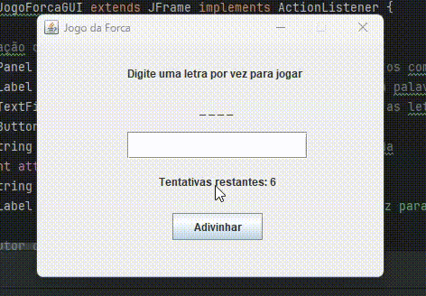

# Jogo da Forca - Documentação

Este é um programa Java que implementa o famoso Jogo da Forca utilizando uma interface gráfica Swing. O jogo consiste em descobrir qual é a palavra oculta. Para isso, o usuário tera algumas tentativas de adivinhar as letras e formar a palavra. Caso o usuário descubra todas as letras dentro do limite de tentativas, ele vence. Caso contrário, é derrotado!

## Pré-requisitos

Certifique-se de ter o Java Development Kit (JDK) instalado em seu sistema para compilar e executar o programa.

## Como compilar e executar

1. Clone este repositório em sua máquina local:

2. Navegue até o diretório do projeto:

3. Compile o código Java:

4. Execute o programa compilado:

5. O jogo Monty Hall será exibido em uma interface gráfica Swing.

## Como jogar

1. Ao iniciar o jogo, você será direcionado a tela principal do jogo.
2. Observe a quantidade de "_" para descobrir quantas letras tem a palavra.
3. Um diálogo aparecerá solicitando que você digite uma letra. Escolha e clique no botão de adivinhar.
4. Após sua escolha, caso tenha acertado uma letra, ela aparecerá no(s) lugar(es) do(s) "_".
5. Se você errar, uma tentativa será decrementada.
6. Após acertar a palavra ou gastar todas as tentativas, uma mensagem informará se você ganhou o prêmio ou não.

## Exemplo Visual

## Contribuição

Contribuições são bem-vindas! Sinta-se à vontade para abrir um Pull Request com melhorias no código ou na documentação.

## Licença

Este projeto está licenciado sob a [Licença MIT](LICENSE).